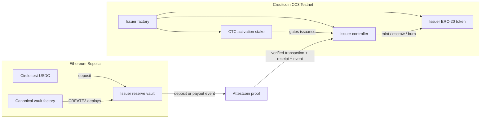
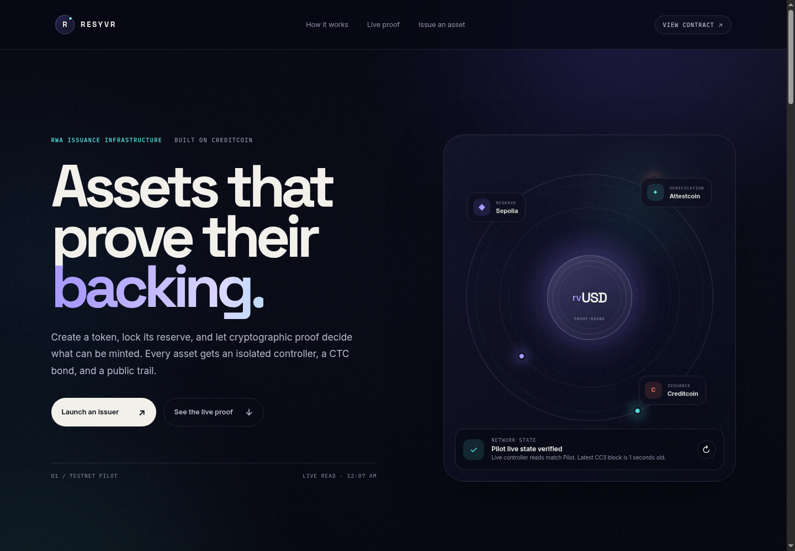
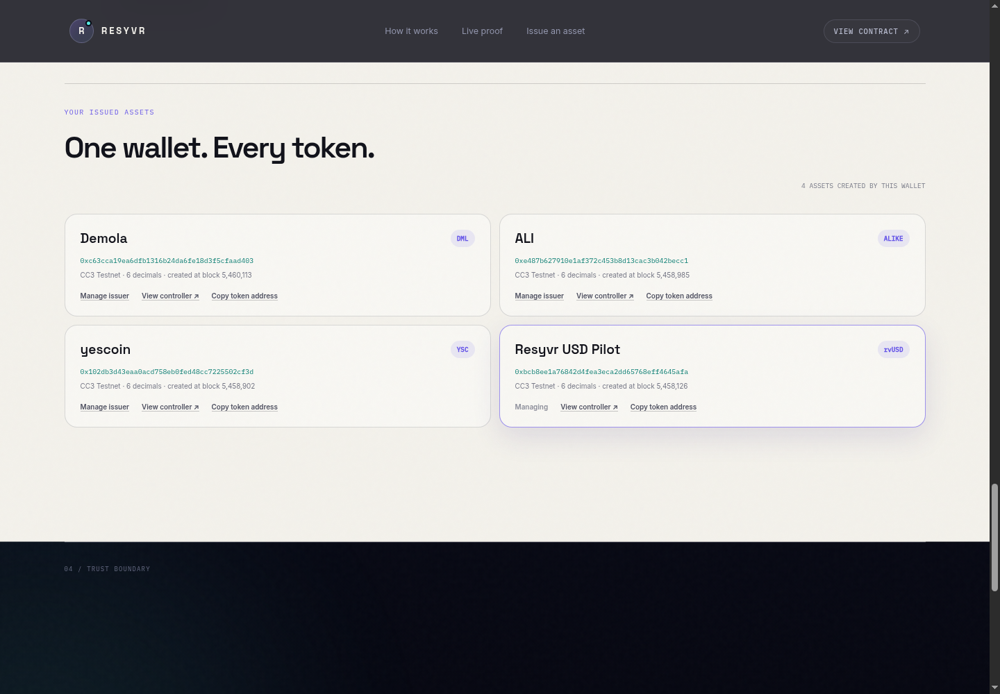

# Resyvr

> Proof-bounded RWA issuance and redemption on Creditcoin.

[](https://dorahacks.io/hackathon/buidl-ctc-2026-fall/buidl)
[](https://creditcoin-testnet.blockscout.com/)
[](contracts/src)
[](contracts/test)

**[Open the live application](https://webghost01-ng.github.io/resyvr/dashboard/)** · **[Judge Evidence: verify V2](https://webghost01-ng.github.io/resyvr/dashboard/judge-evidence.html)** · **[Start issuing](https://webghost01-ng.github.io/resyvr/dashboard/#launch)** · **[Redeem an asset](https://webghost01-ng.github.io/resyvr/dashboard/#redemption)** · **[Source repository](https://github.com/Webghost01-NG/resyvr)**

## The 30-second explanation

Resyvr lets an organization issue a branded real-world asset token on
Creditcoin without trusting a centralized oracle to report its reserve. The
issuer locks test USDC in a canonical Ethereum Sepolia vault. Attestcoin proves
that exact deposit to Creditcoin, where Resyvr checks the vault, asset, issuer,
recipient, amount, receipt status, and replay identity before minting exactly
the proven amount. The reverse flow escrows the token, proves the reserve
payout, and burns the redeemed supply.

The result is a reusable issuance rail with one public trail from reserve lock
to mint, and from redemption request to payout and burn.

## At a glance

| | |
| --- | --- |
| **Hackathon track** | RWA |
| **Destination chain** | Creditcoin CC3 Testnet (`102031`) |
| **Reserve chain** | Ethereum Sepolia (`11155111`) |
| **Reserve asset** | Circle test USDC, 6 decimals |
| **Cross-chain verification** | Creditcoin Attestcoin Protocol |
| **Issuer commitment** | Native CTC activation stake |
| **Current status** | Live testnet issuance and proof-finalized redemption |
| **Contracts** | Solidity 0.8.30 and Foundry |
| **Application** | Dependency-free browser UI with MetaMask |

### Current product boundary

All newly created assets use the V2 contract path: canonical Sepolia vault
provenance, proof-bounded minting, redemption escrow, proven reserve payout,
and supply burn. Existing V1 assets remain visible and usable for their
original issuance-only flow; they are not silently upgraded or represented as
redeemable. This preserves their immutable on-chain configuration while giving
new issuers the complete lifecycle.

## Why Resyvr exists

An inclusion proof answers one narrow question: *did this source-chain
transaction occur in an attested block?* It does not decide whether that
transaction should authorize a token mint.

An RWA issuer still needs to prove that:

- the transaction succeeded;
- the funds entered the correct reserve vault;
- the vault belongs to the correct issuer;
- the configured reserve asset moved;
- the amount and recipient match the intended issuance;
- the same transaction or deposit has never been used before;
- supply stays within the reserve that has passed those checks;
- redemption pays the correct holder before escrowed tokens are burned.

Resyvr turns those requirements into reusable contracts, issuer factories,
canonical vaults, a guided wallet flow, and a public evidence dashboard.

## What the product provides

### For issuers

- Create an isolated controller, ERC-20 token, reserve vault, and CTC stake
  vault for each asset.
- Choose the token name and symbol while the contracts preserve one immutable
  reserve boundary.
- Mint additional units of the same token by making a new reserve deposit and
  proving it; a new token deployment is not required.
- Manage every token created by the connected administrator from an on-chain
  issuer portfolio.
- Pause issuance or redemption without rewriting the asset configuration.

### For token holders

- Receive the exact token amount named by the verified reserve event.
- Inspect the token, controller, reserve provenance, CTC stake, supply, and
  proof-accounting coverage through public links.
- Request redemption by escrowing tokens on Creditcoin.
- Receive the exact reserve amount on Sepolia before the proof finalizes the
  burn on Creditcoin.

### For developers

- Reuse canonical source-vault and issuer factories rather than rebuilding the
  full cross-chain authorization boundary.
- Verify every published deployment and state claim with public RPCs.
- Run unit, fuzz, invariant, dashboard, encoding, preflight, and live evidence
  checks from one command.
- Study explicit failure cases for wrong vaults, beneficiaries, amounts,
  receipts, payout terms, and replay attempts.

## How it works



Creditcoin is the verification and settlement layer. Resyvr calls the CC3
Block Prover precompile through Attestcoin, stores reserve and redemption
accounting on Creditcoin, and uses CTC for gas and the issuer activation stake.
Without Creditcoin, the demonstrated cross-chain authorization gate and native
issuer commitment do not exist.

## Issuance lifecycle

1. **Create a canonical reserve vault on Sepolia.** The vault is derived from
   the published factory, reserve asset, issuer ID, and administrator.
2. **Create the token system on Creditcoin.** The issuer factory deploys an
   isolated controller, branded token, and CTC stake vault.
3. **Post and activate the CTC stake.** Issuance remains disabled until the
   minimum native CTC commitment is funded and activated.
4. **Lock reserve USDC on Sepolia.** The vault emits a unique deposit ID,
   issuer ID, beneficiary, depositor, and exact amount.
5. **Generate the Attestcoin proof.** This requires no wallet signature. The
   proof becomes available after the source block enters Attestcoin coverage.
6. **Submit the proof on Creditcoin.** The controller validates the complete
   transaction and event semantics, consumes two replay keys, records the
   reserve, and mints the exact proven amount.

The beneficiary can be the issuer or another wallet. Importing the resulting
Creditcoin token address into MetaMask only makes the balance visible; tokens
reach a user when a proven deposit names that wallet as beneficiary or when an
existing holder transfers tokens to it.

## Redemption lifecycle

1. The holder approves the controller and requests redemption on Creditcoin.
2. The controller escrows the exact token amount and creates a redemption ID.
3. The issuer pays the named Sepolia recipient from the canonical reserve
   vault using that redemption ID.
4. Attestcoin proves the successful payout transaction to Creditcoin.
5. The controller checks the vault, operator, recipient, amount, issuer ID,
   calldata, event, and replay identities.
6. The controller marks the request complete and burns the escrowed tokens.

Redemption is asynchronous because one Creditcoin transaction cannot
synchronously execute a Sepolia payout. Anyone may submit the eventual proof,
so a relayer can affect timing but cannot change the recipient or amount.

## Application experience

The main dashboard presents the product in the order an issuer needs it:

1. understand the reserve-to-token model;
2. inspect the live public proof trail;
3. issue or reopen an asset;
4. complete a guided redeemable issuance flow;
5. manage every asset created by the connected wallet.

The redemption flow is embedded in the same dashboard at
[`#redemption`](https://webghost01-ng.github.io/resyvr/dashboard/#redemption),
immediately before **Your issued assets**. The fixed navigation keeps issuance,
proofs, and redemption reachable while scrolling. Each wallet action names the
chain, signature count, and effect before MetaMask opens. Confirmed hashes are
saved before receipt polling so a refresh can recover progress without asking
the user to repeat a reserve transfer.

Pending Attestcoin coverage is shown as a normal lifecycle state with a route
back to the required proof action. It is not presented as a failed reserve or a
missing asset.





## Verified live evidence

### V2 complete issuance and redemption pilot

The redeemable pilot locked **100,000 base units (0.1 test USDC)**, minted
**0.1 rvUSD2**, paid the reserve recipient, finalized the proof, and burned the
escrowed supply.

| Component | Network | Address |
| --- | --- | --- |
| Canonical vault factory | Sepolia | [`0x97e2…400f`](https://eth-sepolia.blockscout.com/address/0x97e27c9dAA20fE0D3B7C18A7DBd8ca2A266E400f) |
| Canonical reserve vault | Sepolia | [`0xb733…5A1e`](https://eth-sepolia.blockscout.com/address/0xb733B5680f83f92f978d8862dD689f4372Ec5A1e) |
| Issuer factory | Creditcoin | [`0x9266…f0d8`](https://creditcoin-testnet.blockscout.com/address/0x9266b4af55cdb47da17bf2d8a403113a6f7bf0d8) |
| Issuer controller | Creditcoin | [`0x1349…7834`](https://creditcoin-testnet.blockscout.com/address/0x13497bba153d8417bd75ad14a9ba4651fae57834) |
| rvUSD2 token | Creditcoin | [`0x5b8b…9ac9`](https://creditcoin-testnet.blockscout.com/address/0x5b8b9d3cc8f63f84ab612c78ae1c1cb3019f9ac9) |
| CTC activation stake vault | Creditcoin | [`0x488e…9226`](https://creditcoin-testnet.blockscout.com/address/0x488e45a5fe3ee0f6521ad267c6f5b2b8ace49226) |

| Lifecycle action | Network | Transaction |
| --- | --- | --- |
| Create canonical vault | Sepolia | [`0x2ef2…9945`](https://eth-sepolia.blockscout.com/tx/0x2ef29334599d3c258e73ba95256410eda444f79474d238a9fccc292298c29945) |
| Lock reserve | Sepolia | [`0x52a6…00c7`](https://eth-sepolia.blockscout.com/tx/0x52a6c854c0f75569438f5639c469cd89d99178522767b38e0dc1568e828e00c7) |
| Create V2 issuer | Creditcoin | [`0x0a5b…cdff`](https://creditcoin-testnet.blockscout.com/tx/0x0a5befda33ea5dec986f685e480fdd8895cde7a6c15ef6056c914e8eb2f4cdff) |
| Deposit activation stake | Creditcoin | [`0xafe4…fd40`](https://creditcoin-testnet.blockscout.com/tx/0xafe4e26fb863b10bb195e222d20623cfd31e59a9004b8cea79b44c0bb84cfd40) |
| Activate issuance | Creditcoin | [`0xe6cc…316`](https://creditcoin-testnet.blockscout.com/tx/0xe6ccf042e9155a9fe1d36c316623994326bc8e926607dd7c97af5ac82b784316) |
| Verify deposit and mint | Creditcoin | [`0x7d1d…226b`](https://creditcoin-testnet.blockscout.com/tx/0x7d1df433188d47633c2b10c67bd97e9b4275652a66ddb2432112ae09e39c226b) |
| Approve redemption escrow | Creditcoin | [`0xa80f…6821`](https://creditcoin-testnet.blockscout.com/tx/0xa80f4c42d92c65a2bb35a223ef2fc8d6ec87dde3d8b2d76ab5934d7580736821) |
| Request redemption | Creditcoin | [`0x368e…d5d0`](https://creditcoin-testnet.blockscout.com/tx/0x368e3fc870f5370bcb0d735ade7001296f3b79b201b49bb643ae5c797d5dd5d0) |
| Pay reserve recipient | Sepolia | [`0x0b9f…45e4`](https://eth-sepolia.blockscout.com/tx/0x0b9f8a0a60b6aaf394cf8f1892a65d540aad3c5eada901d78b160fc7a04645e4) |
| Finalize redemption and burn | Creditcoin | [`0xe006…60b0`](https://creditcoin-testnet.blockscout.com/tx/0xe0065570adb21e6316c6d708049efebf5b5bea5427e826b8ea448964421d60b0) |

The completed V2 state is:

| State | Base units | Display amount |
| --- | ---: | ---: |
| Token total supply | `0` | `0 rvUSD2` |
| Pending redemption | `0` | `0 rvUSD2` |
| Net verified reserve | `0` | `0 USDC` |
| Total redeemed | `100000` | `0.1 USDC` |
| Source vault recognized reserve | `0` | `0 USDC` |

This final state demonstrates the complete accounting loop: reserve entered,
matching supply was issued, reserve left for the named redemption, and the
matching supply was burned.

### Historical V1 issuance-only pilot

V1 is preserved as historical issuance evidence and does not support redemption. The original pilot locked **5 test USDC** on Sepolia. A genuine Attestcoin proof
was accepted on Creditcoin and minted exactly **5 rvUSD** to the beneficiary.

| Evidence | Network | Explorer |
| --- | --- | --- |
| Source reserve vault | Sepolia | [`0x99d9…B34f`](https://eth-sepolia.blockscout.com/address/0x99d9d85EAca66c85526cb8DA2CbF9948FD4B34f1) |
| 5 test-USDC deposit | Sepolia | [`0xbc7b…45b`](https://eth-sepolia.blockscout.com/tx/0xbc7b11952b799049cab6159f43c80f4c52242e678891a693f337060e0db3545b) |
| Issuer factory | Creditcoin | [`0xd951…323F`](https://creditcoin-testnet.blockscout.com/address/0xd951A7094814DC2Ab9BE5F5E263A0081C89f323F) |
| Issuer controller | Creditcoin | [`0x81a5…2948`](https://creditcoin-testnet.blockscout.com/address/0x81a5E9379eaa4a2dAed7108120e8059d6CeF2948) |
| rvUSD token | Creditcoin | [`0xbCb8…5Afa`](https://creditcoin-testnet.blockscout.com/address/0xbCb8eE1A76842d4Fea3Eca2dD65768efF4645Afa) |
| 1 CTC stake vault | Creditcoin | [`0x164e…B55f`](https://creditcoin-testnet.blockscout.com/address/0x164e57032b0224C435d7ADD047D57463efcBB55f) |
| Proof-backed mint | Creditcoin | [`0xe5c1…4ddb`](https://creditcoin-testnet.blockscout.com/tx/0xe5c1d4c22e4ea74ff241f6192aea2c786c55f9faac6f2678bc79c6e28c814ddb) |

The V1 source vault currently contains 6 test USDC because a later 1-USDC
deposit has not been submitted as an accepted proof. The controller therefore
reports 5 verified USDC and the token supply remains 5 rvUSD. This is the
intended boundary: an unproven source deposit cannot authorize minting.

## Security model

Attestcoin supplies cryptographic inclusion evidence. Resyvr supplies the
application-level authorization rules. A proof can mint or finalize redemption
only after all relevant rules pass.

### Issuance invariants

- The proof must use the configured source-chain key.
- The transaction receipt must report success.
- The transaction target must be the canonical vault or the configured
  MetaMask transaction executor with the expected routed call.
- The log emitter, event signature, issuer ID, reserve asset, depositor,
  beneficiary, and amount must match immutable configuration and calldata.
- Both the Attestcoin query ID and source deposit ID can be consumed once.
- Minting uses the beneficiary and amount from the verified event.
- Supply cannot exceed net proof-accounted reserve after decimal normalization.
- An active and sufficiently funded CTC stake is required before minting.

### Redemption invariants

- Tokens enter controller escrow before a request becomes pending.
- The source payout must come from the canonical vault and authorized payout
  operator.
- Calldata and the `ReservePaidOut` event must agree on redemption ID,
  recipient, and amount.
- The payout query and redemption ID can each be consumed once.
- Accounting updates and escrow burning occur atomically on Creditcoin.
- The CTC stake cannot be withdrawn while token supply or pending redemption
  liability remains.

The suite also covers failed receipts, duplicate and ambiguous events,
arbitrary source vaults, unauthorized operators, mismatched payout terms,
fee-on-transfer behavior, pause controls, and replay attempts. See
[`docs/security-invariants.md`](docs/security-invariants.md) for the detailed
evidence map.

## Trust boundaries and honest limitations

- The system is deployed on testnets and has not been independently audited.
- Circle test USDC has no financial value.
- Attestcoin proves what happened on the supported source chain; it does not
  guarantee the reserve token issuer itself.
- The displayed ratio is **proof-accounting coverage**. It compares accepted
  reserve proofs with Creditcoin token supply; it is not a general real-time
  solvency rating.
- The CTC vault holds an **activation stake**. There is no slashing mechanism,
  insurance policy, dollar conversion, or automatic holder compensation.
- Redemption requires the issuer to perform the Sepolia payout. Anyone can
  submit its proof afterward, but the protocol still has issuer-liveness risk.
- There is no automatic redemption timeout refund because a payout can be
  complete while its proof is still pending. Refunding tokens in that interval
  could pay the holder twice.

These boundaries are part of the design and visible in the product. Resyvr
does not present itself as an audited stablecoin or claim that CTC is
dollar-stable.

## Repository map

```text
resyvr/
├── contracts/
│   ├── src/                 # V1 issuance and V2 redemption contracts
│   ├── test/                # unit, fuzz, and stateful invariant tests
│   └── script/              # Foundry deployment scripts
├── dashboard/               # public proof dashboard and guided wallet flows
├── config/                  # networks, bytecode, deployments, and evidence
├── docs/                    # architecture, security, operations, and submission
├── scripts/                 # preflight, deployment, and evidence verification
├── src/                     # TypeScript proof generation and validation modules
└── test/                    # TypeScript tests
```

## Run locally

### Requirements

- Node.js 22.12 or newer
- npm
- Foundry (`forge`)
- MetaMask for interactive testnet transactions

Install dependencies and start the static application:

```bash
npm install
npm run dashboard
```

Open <http://127.0.0.1:8000/dashboard/>.

The public dashboard and evidence commands use configured public RPCs and do
not need a private key. Interactive issuance needs a wallet funded with:

- Sepolia ETH for source-chain gas;
- Circle test USDC for the reserve;
- testnet CTC for Creditcoin gas and the activation stake.

Optional RPC overrides can be placed in `.env` using `.env.example` as the
template. Never commit private keys or wallet seed phrases.

## Verify the project

Run the complete validation pipeline:

```bash
npm run check
```

It currently covers:

- TypeScript typechecking and module tests;
- browser JavaScript syntax, DOM contract, and proof encoding checks;
- submission completeness checks;
- **55 Foundry tests**, including fuzz and stateful invariant campaigns;
- Attestcoin protocol and network preflight checks;
- **79 live V1 evidence checks** across Sepolia and Creditcoin;
- **93 live V2 lifecycle checks** covering every receipt, deployed bytecode,
  both Attestcoin proofs, source and destination events, replay state, and the
  final zero-supply/zero-reserve accounting state.

Useful focused commands:

```bash
npm run contracts:check        # format, build, and test Solidity
npm run dashboard:check        # validate the browser application
npm run preflight              # verify Attestcoin/network assumptions
npm run evidence:verify        # reproduce the V1 live evidence
npm run evidence:v2:verify     # verify both canonical V2 factories
npm run evidence:v2:pilot      # reproduce the complete live V2 round trip
```

Read-only verification needs no wallet signature, API key, or private key.

## Documentation

### Start here

- [Architecture and trust boundaries](docs/architecture.md)
- [V2 redemption protocol](docs/redemption-v2.md)
- [Security invariant evidence](docs/security-invariants.md)
- [Live deployment and failure evidence](docs/deployment-evidence.md)

### Build and operate

- [MVP scope and delivery gates](docs/mvp.md)
- [Attestcoin protocol preflight](docs/protocol-preflight.md)
- [Browser wallet flow](docs/wallet-flow.md)
- [Public hosting guide](docs/public-hosting.md)

### Judge and submit

- [RWA submission copy](docs/submission.md)
- [Live Judge Evidence page](https://webghost01-ng.github.io/resyvr/dashboard/judge-evidence.html)
- [Three-minute demo script](docs/demo-script.md)
- [Submission checklist](docs/submission-checklist.md)
- [Competitive landscape](docs/competitive-landscape.md)

## Why this belongs in the RWA track

Resyvr connects off-chain economic value represented by a source-chain reserve
with a transparent Creditcoin asset. The core product is infrastructure for
organizations to create, capitalize, issue, inspect, and redeem tokenized
claims while cryptographic cross-chain evidence controls supply changes.

The project does not claim that cross-chain proofs or lock-to-mint are new.
Its contribution is the issuer control plane around those primitives:
canonical vault provenance, multi-issuer isolation, branded tokens, exact
proof-bound accounting, liability-aware CTC stakes, redemption escrow, replay
protection, and public evidence.

## Current status and roadmap

Completed for the hackathon build:

- live V1 reserve deposit, genuine Attestcoin proof, and exact Creditcoin mint;
- live V2 canonical vault, issuance, redemption payout, proof finalization,
  and supply burn;
- verified V2 source and destination factories;
- self-service wallet flows, multi-issuer portfolio, public proof trail, and
  recoverable transaction state;
- unit, fuzz, invariant, browser, preflight, and reproducible live-evidence
  checks.

The next production milestones are an independent contract audit, broader
source-chain and reserve-asset support, decentralized payout operations,
objective stake-slashing rules, and a formally designed redemption recovery
protocol. Those milestones are future work and are not presented as features
of the testnet build.

## License

MIT
